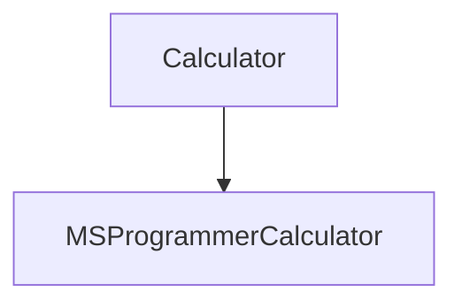

# MSProgrammerCalculator

[**MSProgrammerCalculator:**](/MSProgrammerCalculator/MSProgrammerCalculator)
Calculator application.

[**Calculator:**](/MSProgrammerCalculator/Calculator)
Calculator class library.

[**CalculatorTests:**](/MSProgrammerCalculator/CalculatorTests)
Unit test project.

## Project Build

Visual Studio 2022. .NET Framework 4.8.

## Notes

#### For checking coding style.
Implement the Windows Calculator (Programmer) functionalities through clone coding.

## MSProgrammerCalculator Solution Structure

